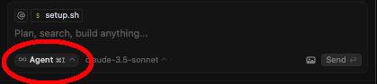

# Next.js and Supabase Blog Template

A fullstack blog template built with Next.js and Supabase.

## Features

- ⚡️ Latest Next.js version and configuration
- 💾 Supabase for database for storage
- 🎨 Tailwind CSS for styling and Shadcn UI for components
- 📱 Responsive design
- 🔍 SEO optimized

## Setup Instructions

This project provides two setup scripts - one for Unix-based systems (macOS, Linux) and one for Windows.

### Prerequisites

- Node.js 20+ (specified in .nvmrc)
- npm
- Supabase account (free tier available)

### Option 1: Setup for macOS/Linux Users

1. Clone this repository
2. Make the setup script executable:
   ```bash
   chmod +x setup.sh
   ```
3. Run the setup script:
   ```bash
   ./setup.sh
   ```
4. Set up your Supabase environment variables:
   - Create a project in Supabase
   - Copy your Supabase URL and anon key
   - Update `.env.local` with your Supabase credentials

5. Start the development server:
   ```bash
   npm run dev
   ```

### Option 2: Setup for Windows Users

1. Clone this repository
2. Open PowerShell with administrator privileges
3. You may need to set the execution policy to run the script:
   ```powershell
   Set-ExecutionPolicy -Scope Process -ExecutionPolicy Bypass
   ```
4. Run the PowerShell setup script:
   ```powershell
   .\setup.ps1
   ```
5. Set up your Supabase environment variables:
   - Create a project in Supabase
   - Copy your Supabase URL and anon key
   - Update `.env.local` with your Supabase credentials

6. Start the development server:
   ```bash
   npm run dev
   ```

## Implementing with Cursor

This template is designed to work with the Cursor IDE and its AI agent (composer). To get started:
1. **Run with Cursor Composer**
   - Open Cursor IDE
   - Press `Cmd + I` (Mac) or `Ctrl + I` (Windows/Linux) to open the Cursor Composer
     - modify the chat mode to 'Agent': 
   - Add both `.cursor/rules/base.mdc` and `.cursor/tasks/init.md` to the composer context
   - Use the following prompt:
     ```
     Go through each task in the init.md file. After you complete each task,
     update the file to check off any task. Run builds and commits after each task.
     Continue with each task until you have checked off each one. After each story,
     do not take a screenshot. If you need more detail about a task, you can gather
     relevant files and pass the FULL file to the research agent.
     ```

2. **Monitor Progress**
   - The agent will work through each task in order
   - Tasks will be checked off automatically as they're completed
   - Commits will be made after each task
   - You can monitor progress in the cursor-tasks.md file

## Database Setup

After setting up your Supabase project, you'll need to create the necessary tables and seed data:

1. In your Supabase dashboard, navigate to the SQL Editor
2. Create the required tables by running the SQL scripts in the `.cursor/tasks/init.md` file
3. Seed the database with sample data using the provided queries

## Project Structure

```
src/
├── app/                    # Next.js App Router
│   ├── blog/               # Blog routes
│   │   ├── [slug]/         # Individual blog post route
│   │   └── page.tsx        # Blog listing page
│   ├── layout.tsx          # Root layout
│   └── page.tsx            # Homepage
├── components/             # React components
│   ├── blog/               # Blog-specific components
│   │   ├── markdown-renderer.tsx
│   │   ├── post-card.tsx
│   │   ├── post-grid.tsx
│   │   └── post-header.tsx
│   ├── ui/                 # Shadcn UI components
│   ├── footer.tsx          # Site footer
│   └── header.tsx          # Site header
└── lib/                    # Utility functions
    ├── api.ts              # API functions for Supabase
    ├── database.ts         # TypeScript types for database
    ├── supabase.ts         # Supabase client initialization
    └── utils.ts            # General utility functions
```

## Contributing

Contributions are welcome! Please feel free to submit a Pull Request.

## License

This project is licensed under the MIT License.